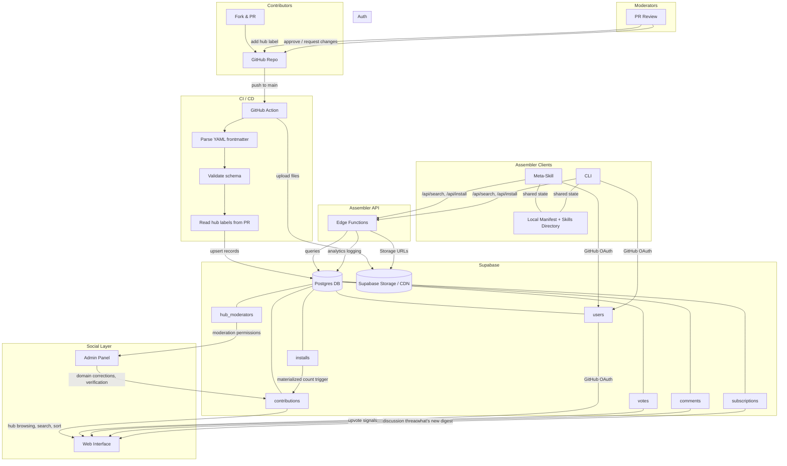

# Platform Architecture

## Overview

vibecodin.gg is a three-layer platform: a **data layer** that syncs structured contribution records from Git into a queryable database, a **social layer** that adds discovery, discussion, and community signals on top of that data, and an **assembler** that lets users install and run contributions locally. This document covers the architecture decisions, data flow, and infrastructure for each layer.

This is a living spec. Sections marked `[PENDING]` are planned but not yet designed.

---

## Design Principles

1. **Git is the source of truth for contribution content.** The repository owns every contributor-authored field. The database is a derived, enriched view — not a competing source of truth.

2. **Platform data lives in the database only.** Fields managed by the platform (domain, subdomain, verified, upvotes, usage_count) are never written back to the Git repo. This keeps the contributor experience clean and avoids automated commit noise.

3. **The schema is the contract.** The YAML frontmatter schema defined in `docs/SCHEMA.md` is the interface between contributors and the platform. Both sides honor it. The sync pipeline enforces it.

4. **Low cost, no functionality sacrifice.** Infrastructure choices favor managed services with strong free tiers and no vendor lock-in on the data layer (Postgres).

---

## Layer 1: Data

### Sync Direction

**One-way: Git → Database.**

The Git repository is the canonical source for all contributor-authored content. A sync pipeline extracts YAML frontmatter on every merge to `main`, upserts records into the database, and uploads contribution files to object storage. Platform fields (upvotes, verified status, usage counts, domain assignment) exist only in the database and are never written back to Git.

This model was chosen because:

- It honors the contributor/platform field separation already designed into the schema
- It avoids automated commits that pollute the repo's Git history
- It eliminates merge conflicts between contributor updates and platform metadata writes
- Platform metadata (upvote counts, usage stats) is ephemeral social data — it has no value in the repo context

### Infrastructure

**Database: Supabase (Postgres)**

Supabase provides Postgres with built-in authentication, real-time subscriptions, edge functions, a REST/GraphQL API, object storage, and row-level security. The free tier covers early-stage needs. The Pro tier ($25/month) handles meaningful scale. Because the underlying engine is standard Postgres, there is no lock-in — migration to self-hosted Postgres, Neon, or Railway requires no query rewrites.

Supabase was selected because:

- GitHub OAuth is built in (contributors authenticate with the same identity they use to submit PRs)
- Real-time subscriptions power live upvote counts, new contribution feeds, and discussion updates without custom WebSocket infrastructure
- The REST API eliminates the need to build and host a separate API server for the web interface
- Row-level security policies enforce access control at the database level (e.g., users can only delete their own votes)
- Object storage (Supabase Storage) serves contribution files from a CDN, decoupling the assembler from GitHub rate limits

### Database Schema

Four core tables:

**`contributions`**

| Column | Type | Notes |
|---|---|---|
| `id` | text (PK) | Directory name, e.g. `email-subject-line-optimizer` |
| `name` | text | Human-readable name |
| `type` | enum | `skill` or `agent` |
| `version` | text | Semantic version string |
| `description` | text | One-sentence description (max 280 chars) |
| `author` | text | GitHub handle |
| `tags` | text[] | Postgres array for filtering and search |
| `license` | text | SPDX identifier |
| `created` | date | Contribution creation date |
| `updated` | date | Last update date |
| `tested_with` | text[] | Model IDs validated against |
| `skill_fields` | jsonb | Skill-specific fields (trigger, commands, dependencies). Null for agents. |
| `agent_fields` | jsonb | Agent-specific fields (model, system_prompt, memory, tools, behaviors, dependencies). Null for skills. |
| `raw_readme` | text | Full markdown body below frontmatter, rendered on the platform |
| `domain` | text | Hub assignment (platform-managed) |
| `subdomain` | text | Sub-domain assignment (platform-managed) |
| `verified` | boolean | Moderator verification status (default: false) |
| `verification_date` | date | Date of last verification (nullable) |
| `verification_model` | text | Model used during verification (nullable) |
| `upvotes` | integer | Materialized count from votes table (default: 0) |
| `usage_count` | integer | Assembler install/reference count (default: 0) |
| `synced_at` | timestamptz | Last sync from Git |
| `deleted_at` | timestamptz | Soft delete timestamp (nullable) |

**`users`**

| Column | Type | Notes |
|---|---|---|
| `id` | uuid (PK) | References Supabase `auth.users` |
| `github_handle` | text (unique) | GitHub username |
| `display_name` | text | Display name on platform |
| `avatar_url` | text | GitHub avatar |
| `created_at` | timestamptz | Account creation |

**`votes`**

| Column | Type | Notes |
|---|---|---|
| `user_id` | uuid (FK → users) | Who voted |
| `contribution_id` | text (FK → contributions) | What they voted on |
| `created_at` | timestamptz | When they voted |

Unique constraint on `(user_id, contribution_id)`. A Postgres trigger on insert/delete updates the materialized `upvotes` count on the contributions table.

**`comments`**

| Column | Type | Notes |
|---|---|---|
| `id` | uuid (PK) | Comment identifier |
| `contribution_id` | text (FK → contributions) | Parent contribution |
| `user_id` | uuid (FK → users) | Comment author |
| `parent_id` | uuid (FK → comments, nullable) | For threaded replies |
| `body` | text | Comment content |
| `created_at` | timestamptz | Created |
| `updated_at` | timestamptz | Last edited |

### PR Validation (GitHub Action on Pull Request)

Triggered on pull request open and update. Runs before merge to catch issues early.

**Schema validation**: Parse the new or modified contribution's `README.md`, validate YAML frontmatter against all schema rules from `docs/SCHEMA.md`. Fail the check if required fields are missing, types are wrong, or platform fields are included.

**Near-duplicate detection**: Compare the proposed directory name against all existing directory names within the same contribution type (`skills/` or `agents/`). Flag potential conflicts using string similarity (Levenshtein distance) and substring matching. If a match scores above threshold, the action posts a comment on the PR: *"Note: a contribution named `invoice-data-extractor` already exists in skills/. Please confirm this is not a duplicate."* This is advisory — it does not block the merge. The moderator makes the final call.

> **Future consideration**: As the library grows and namespace pressure increases, names may be scoped to subdomain (e.g., `marketing/email-automation/email-triage`) to expand the available namespace. A contributor helper script for name selection is planned but deferred.

### Sync Pipeline (GitHub Action on Push to Main)

Triggered on push to `main`. Three stages:

**Stage 1: Parse**

Walk `contributions/skills/` and `contributions/agents/`. For each directory, read `README.md`, extract YAML frontmatter, and validate against schema rules (required fields, type constraints, validation rules from `docs/SCHEMA.md`). Collect the full markdown body below the frontmatter as `raw_readme`.

**Stage 2: Upsert to Database**

Compare parsed records against existing rows in Supabase.

- **New contributions** (directory exists in Git but not in DB): Insert with contributor fields populated. Platform fields initialized to defaults (`verified: false`, `upvotes: 0`, `usage_count: 0`). Domain and subdomain set from the merged PR's hub label (format: `hub:{domain}/{subdomain}`).
- **Updated contributions** (directory exists in both): Update contributor fields only. Platform fields are untouched.
- **Deleted contributions** (row exists in DB but directory is gone from Git): Set `deleted_at` to current timestamp. Do not hard-delete — this preserves vote and comment history.

**Stage 3: Upload to Storage**

For each contribution directory, upload all files to Supabase Storage under a mirrored path structure:

```
storage/contributions/skills/email-subject-line-optimizer/README.md
storage/contributions/skills/email-subject-line-optimizer/[supporting files]
storage/contributions/agents/interview-prep-agent/README.md
storage/contributions/agents/interview-prep-agent/system-prompt.md
```

Overwrite existing files. Remove files for soft-deleted contributions.

### Domain and Subdomain Assignment

**Primary mechanism: GitHub PR labels.**

During PR review, the moderator adds a label following the format `hub:{domain}/{subdomain}` (e.g., `hub:marketing/email-automation`). The sync pipeline reads this label from the merged PR and sets the `domain` and `subdomain` fields in the database.

**Fallback mechanism: Supabase admin panel.**

A lightweight admin interface (built on Supabase's dashboard or a custom admin page) allows moderators to correct domain/subdomain assignments after merge, toggle verified status, and manage contribution records directly. This handles cases where labels are missed, incorrect, or need revision after the fact.

### Search and Discovery

Postgres full-text search on `description` and `raw_readme` columns, combined with array containment queries on `tags`, covers the primary search patterns:

- Browse by hub: `WHERE domain = 'marketing'`
- Browse by subdomain: `WHERE domain = 'marketing' AND subdomain = 'email-automation'`
- Search by keyword: Full-text search index on `description` and `raw_readme`
- Filter by tag: `WHERE tags @> ARRAY['email', 'triage']`
- Sort by popularity: `ORDER BY upvotes DESC`
- Sort by usage: `ORDER BY usage_count DESC`
- Filter verified: `WHERE verified = true`

A GIN index on `tags` and a full-text search index on `description || ' ' || raw_readme` ensure these queries perform well at scale.

### Content Versioning

**Only the latest version is available on the platform.** When a contributor updates their submission and bumps the `version` field, the sync pipeline overwrites the existing DB record and Storage files. The assembler always fetches the current version. There is no version selection UI and no versioned storage paths.

**Rationale:** Contributions are leaf nodes — they don't form dependency trees where a breaking change in one skill cascades to others. The worst case when a skill updates is that the prompt behaves differently, and users who are satisfied with their current version can simply not run `vibecodin update`. Git itself serves as the version history — any previous version of a contribution can be recovered from the commit where it existed.

**What the assembler tracks locally:** The manifest records the version installed. The update flow compares the local version against the DB version and only pulls changes when the DB version is newer. Users are never force-updated.

> **Future consideration:** If team or enterprise use cases emerge that require version pinning (e.g., "everyone on the team must use email-triage@1.2.0"), the platform can add versioned storage paths (`contributions/skills/email-triage/1.0.0/`, `1.1.0/`, etc.), a versions array on the contributions record, and `vibecodin install <id>@<version>` support in the assembler. The schema already includes a `version` field, so the data model is ready — the infrastructure just isn't needed yet.

### API Layer

Assembler clients (meta-skill and CLI) do not talk directly to Supabase's auto-generated REST API. Instead, they communicate through **Supabase Edge Functions** that provide a stable, versioned API contract. The web interface may talk to Supabase directly since both sides are first-party controlled.

**Why a proxy from the start:**

- **Schema decoupling.** If the assembler talks directly to PostgREST, clients are coupled to the database schema. Renaming a column or restructuring a table breaks every assembler client in the wild. Edge functions absorb schema changes — the assembler calls `/api/search` and the function translates that into whatever the current DB query requires. This means the backend can evolve without forcing CLI version upgrades.
- **Analytics.** The proxy layer logs application-level events that the database alone doesn't capture: which contributions are searched for but not installed (intent signal), what search queries return no results (gap signal), how many unique assembler clients are active per week. These events are logged to a lightweight analytics table or external service.
- **Rate limiting.** Edge functions enforce per-user rate limits on assembler operations using the authenticated user's token. This protects against abuse without relying on Supabase's blanket rate limits, and allows different limits for different operations (e.g., search is generous, install is tighter).

**Assembler API endpoints:**

| Endpoint | Method | Auth | Description |
|---|---|---|---|
| `/api/search` | GET | Optional | Search contributions by keyword, tags, hub, type, sort order. Returns paginated results with metadata and social signals. |
| `/api/contributions/:id` | GET | Optional | Fetch full details for a single contribution. |
| `/api/install/:id` | POST | Required | Record an install. Upserts the `installs` table row and triggers `usage_count` update. Returns the Supabase Storage URLs for the contribution's files. |
| `/api/update/check` | POST | Required | Accepts a list of contribution IDs and versions. Returns which have newer versions available. |
| `/api/auth/status` | GET | Required | Verify the current auth token is valid. Returns user profile. |

Search and info endpoints are optionally authenticated — unauthenticated users can browse and search, but cannot install. Install and update endpoints require a valid GitHub OAuth token.

**Infrastructure:** Supabase Edge Functions run on Deno at the edge, deploy from the Supabase CLI, and are included in both the free and Pro tiers (2M invocations/month free). No additional infrastructure cost.

---

## Layer 2: Social

### Design Philosophy

The social layer exists to make the tool more trustworthy and the contributions better. It is not a community platform — it is a set of signals and structures that help users find high-quality contributions fast and help contributors improve their work over time. The primary experience is infrastructure, not engagement.

### Hub-Centric Navigation

The interface is organized around hubs, not a global feed. Users land on a view of the 12 domain hubs and drill into the ones relevant to their work. Inside a hub, contributions are organized by subdomain and sortable by:

- **Upvotes** — community quality signal
- **Usage count** — how many times the assembler has installed/referenced this contribution
- **Recency** — newest contributions first
- **Verified status** — moderator-endorsed contributions surfaced

This mirrors a Slack-like channel structure: hubs are channels, subdomains are threads within those channels. You go to where your domain lives, and that's your context. There is no algorithmically ranked global timeline.

### Subscriptions

Users can follow hubs or individual subdomains. Following a hub surfaces new contributions and updates in a lightweight "what's new" view — not a real-time stream, but a digest of activity since the user last checked. This is powered by Supabase real-time subscriptions on the `contributions` table, filtered by the user's followed domains.

**`subscriptions` table:**

| Column | Type | Notes |
|---|---|---|
| `id` | uuid (PK) | Subscription identifier |
| `user_id` | uuid (FK → users) | Who is subscribed |
| `scope_type` | enum | `hub` or `subdomain` |
| `scope_value` | text | Domain name (e.g., `marketing`) or `domain/subdomain` (e.g., `marketing/email-automation`) |
| `created_at` | timestamptz | When the subscription was created |

Unique constraint on `(user_id, scope_type, scope_value)`.

### Social Signals

The signals that matter for a power-tool user are visible on every contribution card without clicking into it:

- **Verified badge** — a moderator has reviewed and endorsed this contribution
- **Usage count** — real adoption signal from the assembler
- **Upvote count** — community quality signal
- **Author attribution** — who built this and what else have they contributed

These four signals are the social layer's primary output. Everything else (discussion, profiles, moderation) exists to support and maintain the integrity of these signals.

### Discussion Threads

Each contribution has a discussion thread — lightweight, similar to GitHub issue threads. The purpose is functional: report problems, ask usage questions, suggest improvements, request features. This is not a conversation space. It is a feedback channel attached to a specific piece of infrastructure.

Discussion uses the `comments` table defined in the data layer. Threaded replies are supported via the `parent_id` field. Comments are displayed chronologically within a contribution's page.

### Contributor Profiles

User identity on the platform is a contributor profile. A contributor's page shows:

- Their contributions (with upvote and usage counts for each)
- Total upvotes received across all contributions
- Number of verified contributions
- Hub activity (which domains they contribute to)

This builds reputation organically without a separate reputation system, points economy, or gamification. A contributor's track record speaks for itself through the same signals that apply to individual contributions.

### Moderation Structure

Each hub has designated moderators — domain experts with verified contributions in that space. Moderators are visible on the hub page, similar to how Slack channels display admins.

Moderator responsibilities:

- PR review and domain/subdomain assignment (via GitHub labels)
- Verification of contributions (setting `verified: true` and `verification_model`)
- Correcting hub placement via the admin panel
- Managing discussion threads (flagging, removing off-topic or abusive content)

**`hub_moderators` table:**

| Column | Type | Notes |
|---|---|---|
| `id` | uuid (PK) | Record identifier |
| `user_id` | uuid (FK → users) | The moderator |
| `domain` | text | Hub they moderate (e.g., `marketing`) |
| `appointed_at` | timestamptz | When they were appointed |
| `appointed_by` | uuid (FK → users, nullable) | Who appointed them (null for founding moderators) |

A user can moderate multiple hubs. The admin panel respects this table for permission checks — only hub moderators can modify contributions within their domain.

### Verification Workflow

Contributions go live on the platform immediately upon merge. The verified badge is earned through a separate moderator review process — it is not a gate to visibility. Users can filter to verified-only contributions if they want a higher quality floor, but unverified contributions are always accessible.

**Verification checklist (manual + structured):**

The moderator follows a four-item checklist. All four must pass for verification.

1. **Documentation quality.** Does the Overview accurately describe what this contribution does? Does the Usage section explain how to invoke it and what to expect? Are the examples realistic and representative? Is anything misleading or overpromised?

2. **Functional test.** The moderator runs the skill or agent against at least one model, testing the most common use case described in the Examples section. They confirm it produces useful output without errors, hallucinations, or broken tool calls. The model used for this test is recorded as `verification_model`.

3. **Domain accuracy.** Is this contribution placed in the correct hub and subdomain? Does it overlap significantly with an existing verified contribution? If there's overlap, is this contribution differentiated enough to justify its existence?

4. **Safety and quality.** Does the contribution include appropriate guardrails (e.g., "never sends emails without user confirmation")? For agents, does the system prompt contain anything harmful, misleading, or that violates platform guidelines? Is the contribution licensed correctly?

**Verification outcomes:**

- **Pass:** The moderator sets `verified: true`, `verification_date` (current date), and `verification_model` (the model they tested with) via the admin panel.
- **Fail:** The moderator leaves a comment on the contribution's discussion thread explaining what needs to change. `verified` remains `false`. The contributor can address the feedback and request re-review.

**Relationship to CI validation:**

Schema compliance (required fields, type constraints, validation rules) is already enforced by the CI pipeline on PR submission. The verification checklist picks up where CI leaves off — CI handles structure, moderators handle substance.

> **Future consideration:** The checklist items map to automatable checks. Documentation quality and functional testing can be evaluated by running the contribution against test inputs and having an LLM assess the outputs. Domain accuracy can be checked against tag similarity and existing contributions. The manual checklist establishes the criteria that a future automated verification system will execute.

### Moderation Tooling

Moderators have a defined set of actions available through the admin panel. The moderation surface is deliberately narrow — the platform has no real-time chat, no DMs, and no algorithmic feed, so the moderation scope is limited to contributions, discussion threads, and contributor accounts.

**Contribution-level actions:**

| Action | Effect | Use Case |
|---|---|---|
| Reassign domain/subdomain | Changes hub and/or subdomain placement | Contribution was categorized incorrectly |
| Verify / Unverify | Sets or clears the verified badge and related fields | Verification checklist passed, or contribution degraded after update |
| Hide | Removes from search results and hub browsing. DB record, votes, comments, and install history are preserved. | Reported as harmful, broken, or misleading — under investigation |
| Remove | Soft-deletes the contribution (sets `deleted_at`). Disappears from platform entirely. Data preserved for audit. | CLA violation, harmful content, or contributor-requested removal |

**Comment-level actions:**

| Action | Effect | Use Case |
|---|---|---|
| Delete comment | Removes a specific comment from a discussion thread | Spam, abuse, or off-topic content |
| Lock thread | Prevents new comments on a contribution's discussion. Existing comments remain visible. | Thread has become unproductive or heated |

**Contributor-level actions:**

| Action | Effect | Use Case |
|---|---|---|
| Ban | Prevents the user from submitting new contributions, commenting, or voting. Existing contributions remain on the platform unless independently removed. | Repeated violations, spam accounts, or bad-faith participation |

**What moderation does not include:**

- **Editing someone else's contribution.** Moderators can hide or remove, but they do not rewrite other people's work. If something needs fixing, the moderator comments on the discussion thread and the contributor updates their PR.
- **Shadow banning.** The platform is transparent. If a user is banned, they are informed.
- **Granular permission tiers.** One moderator role per hub is sufficient. There are no junior/senior moderator distinctions.

**Supporting data:** The `contributions` table already has `deleted_at` for soft deletes. Hidden status requires a new boolean column:

| Column | Type | Notes |
|---|---|---|
| `hidden` | boolean | Whether this contribution is hidden from public views (default: false) |
| `hidden_at` | timestamptz | When it was hidden (nullable) |
| `hidden_by` | uuid (FK → users, nullable) | Which moderator hid it (nullable) |

The `comments` table needs a soft-delete column:

| Column | Type | Notes |
|---|---|---|
| `deleted_at` | timestamptz | Soft delete timestamp (nullable) |
| `deleted_by` | uuid (FK → users, nullable) | Which moderator deleted it (nullable) |

The `users` table needs a ban column:

| Column | Type | Notes |
|---|---|---|
| `banned` | boolean | Whether this user is banned (default: false) |
| `banned_at` | timestamptz | When they were banned (nullable) |
| `banned_by` | uuid (FK → users, nullable) | Which moderator banned them (nullable) |
| `ban_reason` | text | Reason for the ban (nullable) |

Thread lock status is tracked on the contributions table:

| Column | Type | Notes |
|---|---|---|
| `thread_locked` | boolean | Whether the discussion thread is locked (default: false) |
| `thread_locked_at` | timestamptz | When it was locked (nullable) |
| `thread_locked_by` | uuid (FK → users, nullable) | Which moderator locked it (nullable) |

### What the Social Layer Does Not Include

To keep the platform focused as a power tool:

- **No algorithmic feed.** Content is sorted by explicit, transparent criteria (upvotes, usage, recency, verified). No opaque ranking.
- **No direct messaging.** Contributors communicate through discussion threads on contributions or through GitHub (where the code lives).
- **No gamification.** No points, badges (beyond verified), streaks, or levels. Reputation is implicit in contribution quality.
- **No real-time chat.** The platform is not synchronous. The Slack analogy is structural (channels/hubs), not behavioral (live presence and chat).

---

## Layer 3: Assembler

### Design Philosophy

The assembler is the Homebrew-equivalent system for vibecodin.gg. In Homebrew terms: the schema is the formula, the repo is the tap, and the assembler is the CLI that handles search, install, and execute. The assembler has two interfaces — a meta-skill that runs inside Claude environments and a standalone CLI for terminal users — both backed by the same Supabase API and sharing the same local state.

### Shared Backend

Both interfaces communicate with the same Supabase API. The assembler operations are:

| Operation | Supabase Interaction | Local Interaction |
|---|---|---|
| **Search** | Query `contributions` table (full-text search, tags, domain, subdomain, type, sort) | None |
| **Info** | Fetch full contribution record from DB | None |
| **Install** | Fetch metadata from DB, fetch files from Storage, increment `usage_count`, record install in `installs` table | Write files to local skill/agent directory, update local manifest |
| **Update** | Compare installed versions against DB, fetch updated files from Storage | Overwrite local files, update manifest |
| **List** | None | Read local manifest |
| **Remove** | None | Delete local files, update manifest |

### Authentication

Installs require GitHub OAuth authentication. Both the meta-skill and CLI authenticate the user before allowing install, update, or remove operations. This enables:

- Accurate `usage_count` tracking (one increment per authenticated user per contribution, not per request)
- Install history per user (enables "what have I installed" across devices)
- Personalized recommendations in the future (users who installed X also installed Y)
- Contributor analytics (who is actually using your work)

**CLI authentication flow:** The CLI opens a browser-based GitHub OAuth flow on first use (similar to `gh auth login`). The resulting token is stored locally and reused for subsequent operations.

**Meta-skill authentication flow:** The meta-skill prompts the user to authenticate via a one-time OAuth flow. The token is stored in the local vibecodin config directory. If the user is already authenticated in the CLI, the meta-skill reuses that token.

**`installs` table (new):**

| Column | Type | Notes |
|---|---|---|
| `id` | uuid (PK) | Install record identifier |
| `user_id` | uuid (FK → users) | Who installed it |
| `contribution_id` | text (FK → contributions) | What they installed |
| `version` | text | Version installed |
| `installed_at` | timestamptz | When it was installed |
| `updated_at` | timestamptz | Last update timestamp |
| `active` | boolean | Whether this install is still active (false after remove) |

Unique constraint on `(user_id, contribution_id)`. The `usage_count` on the contributions table is a materialized count of active installs from this table, maintained by a Postgres trigger — same pattern as upvotes.

### Local State

Both interfaces read and write the same local files, making them fully interchangeable. A user can install via the meta-skill and manage via the CLI, or vice versa.

**Local manifest file:** `~/.vibecodin/manifest.json`

```json
{
  "version": "1.0.0",
  "auth": {
    "github_handle": "paulbrown",
    "token_path": "~/.vibecodin/auth.json"
  },
  "installed": {
    "email-subject-line-optimizer": {
      "type": "skill",
      "version": "1.0.0",
      "installed_at": "2026-04-04T12:00:00Z",
      "updated_at": "2026-04-04T12:00:00Z",
      "install_path": ".claude/skills/email-subject-line-optimizer/"
    },
    "interview-prep-agent": {
      "type": "agent",
      "version": "1.0.0",
      "installed_at": "2026-04-04T14:30:00Z",
      "updated_at": "2026-04-04T14:30:00Z",
      "install_path": ".claude/skills/interview-prep-agent/"
    }
  }
}
```

**Install target directories:** Skills are written to `.claude/skills/{contribution-id}/`. Agents follow the same pattern. The assembler writes the full contribution directory contents (README.md, system-prompt.md, supporting files) as-is from Supabase Storage.

### Interface 1: Meta-Skill

The meta-skill is a vibecodin.gg skill that gets installed into `.claude/skills/vibecodin/`. It is the in-environment interface — a skill that installs and manages other skills. Its SKILL.md trigger is:

> Use this skill when the user wants to search for, browse, install, update, remove, or manage skills and agents from vibecodin.gg.

**Example interactions:**

- *"Find me a skill for triaging my inbox"* → Searches by keyword, presents 3-5 results with name, description, upvotes, usage count, and verified status. Asks which to install.
- *"Install the email-subject-line-optimizer"* → Authenticates if needed, fetches files, writes to `.claude/skills/`, updates manifest, confirms success.
- *"What do I have installed from vibecodin?"* → Reads manifest, lists installed contributions with versions and install dates.
- *"Update all my vibecodin skills"* → Checks each installed contribution against the DB for version changes, pulls updates, reports what changed.
- *"Show me the top marketing skills"* → Queries by hub, sorted by upvotes, presents results.

The meta-skill is self-bootstrapping — it is the first skill a user installs, and it makes all subsequent installs possible from within Claude.

### Interface 2: CLI

An npm package providing explicit commands for terminal users.

**Installation:**

```bash
npm install -g vibecodin
```

**Commands:**

```
vibecodin auth              # Authenticate via GitHub OAuth
vibecodin search <query>    # Search contributions by keyword
  --hub <domain>            #   Filter by hub
  --type <skill|agent>      #   Filter by type
  --sort <upvotes|usage|recent>  #   Sort order (default: upvotes)
  --verified                #   Only show verified contributions
vibecodin info <id>         # Show full details for a contribution
vibecodin install <id>      # Install a contribution
vibecodin install <id>@<version>  # Install a specific version
vibecodin update            # Update all installed contributions
vibecodin update <id>       # Update a specific contribution
vibecodin list              # List installed contributions
vibecodin remove <id>       # Remove an installed contribution
```

**Output format:** The CLI outputs structured, scannable results. Search results show a compact card per contribution:

```
email-subject-line-optimizer (skill) v1.0.0
  Generates and A/B tests email subject lines for higher open rates.
  ⬆ 142  📦 891  ✓ verified  hub:marketing/email-automation
  by: paulbrown

lead-qualification-scorer (skill) v1.0.0
  Scores inbound leads based on firmographic and behavioral signals.
  ⬆ 98   📦 567  ✓ verified  hub:sales/lead-generation
  by: paulbrown
```

The CLI is also the interface for CI/CD pipelines — teams can include `vibecodin install <id>` in their setup scripts to ensure consistent skill environments across team members.

### Install Flow (Both Interfaces)

The install process is identical regardless of interface:

1. **Authenticate** — Verify the user has a valid GitHub OAuth token. Prompt to authenticate if not.
2. **Resolve** — Query Supabase for the contribution record by ID. Fail if not found or if soft-deleted.
3. **Check for conflicts** — Read the local manifest. If the contribution is already installed, prompt to update instead.
4. **Fetch files** — Download all files for the contribution from Supabase Storage.
5. **Write locally** — Create the contribution directory under the appropriate install path and write all files.
6. **Update manifest** — Add the contribution to `~/.vibecodin/manifest.json` with version and timestamp.
7. **Record install** — Upsert a row in the `installs` table in Supabase. This triggers the Postgres function that updates the materialized `usage_count` on the contributions table.

### Update Flow

1. Read the local manifest to get all installed contributions and their versions.
2. Batch-query Supabase for the current versions of all installed contributions.
3. Compare. For each contribution where the DB version is newer than the local version:
   a. Fetch updated files from Storage.
   b. Overwrite local files.
   c. Update the manifest entry.
   d. Update the `installs` table row.
4. Report what changed.

### Onboarding

Both entry points are documented as equals. Users choose based on their environment:

- **Cowork / Claude Desktop users** → Start by installing the meta-skill. A one-line instruction on the vibecodin.gg homepage: download the `vibecodin` skill directory and drop it into `.claude/skills/`.
- **Terminal / Claude Code users** → Start with the CLI. `npm install -g vibecodin && vibecodin auth` gets them running in 30 seconds.
- **Either path leads to the same place.** Once set up, the meta-skill and CLI are interchangeable because they share the manifest and install directories.

### What the Assembler Does Not Include

- **Dependency resolution.** If skill A depends on skill B (declared in the schema's `dependencies.skills` field), the assembler does not auto-install skill B. It warns the user that a dependency is missing and tells them to install it. Automatic transitive installs introduce complexity and risk (version conflicts, circular dependencies) that isn't justified at this stage.
- **Execution runtime.** The assembler installs skills and agents — it does not run them. Execution is handled by the host environment (Claude, Cowork, Claude Code). The assembler's job ends when the files are on disk.
- **Version pinning or lockfiles.** The manifest tracks what's installed and at what version, but there is no lockfile mechanism for reproducible environments. This is a future consideration as team use cases emerge.

---

## Data Flow Diagram



---

## Front-End

### Stack

| Component | Choice | Rationale |
|---|---|---|
| Framework | Next.js (App Router) | Best Vercel integration, first-party Supabase libraries (`@supabase/ssr`), routing maps directly to hub/subdomain/contribution information architecture |
| Hosting | Vercel | Free tier covers hobby/early stage, edge functions, preview deploys, analytics built in |
| Styling | Tailwind CSS | Utility-first, dark theme support via `dark:` variants, no runtime CSS overhead |
| Components | shadcn/ui | Accessible, unstyled-by-default components themed to match dark dev-tool aesthetic. Not a dependency — components are copied into the project. |
| Language | TypeScript | Type safety across the full stack, Supabase generates types from the DB schema |

### Design Direction

Dark, minimal, dev-tool aesthetic. Reference points: Linear, Vercel dashboard, Raycast. Key characteristics:

- Dark background (`zinc-950` or `neutral-950` range)
- Clean sans-serif typography (Inter or Geist) with monospace accents for code/technical content
- Subtle borders and dividers, not heavy shadows
- Accent color for interactive elements (to be determined — likely a cool tone that works on dark backgrounds)
- Contribution cards show the four social signals (verified badge, upvote count, usage count, author) at a glance
- Information density over whitespace — this is a power tool, not a marketing site

### Route Structure

The URL structure mirrors the hub/subdomain/contribution hierarchy:

```
/                           → Landing page (hub overview grid)
/hubs                       → All hubs listing
/hubs/[hub]                 → Hub page (subdomains + contributions)
/hubs/[hub]/[subdomain]     → Subdomain page (filtered contributions)
/c/[id]                     → Contribution detail page (readme, signals, discussion)
/u/[github-handle]          → Contributor profile
/search                     → Search results page
/dashboard                  → Authenticated user's subscriptions and activity
/admin                      → Moderator admin panel (protected)
/auth/callback              → GitHub OAuth callback
```

### Hub Slug Mapping

The canonical mapping from hub display names to URL slugs. These slugs are used in routes, PR labels, and the `domain` field in the database.

| Hub Display Name | Slug | Label Format Example |
|---|---|---|
| Marketing | `marketing` | `hub:marketing/content-marketing` |
| Sales | `sales` | `hub:sales/lead-generation` |
| Finance & Accounting | `finance-accounting` | `hub:finance-accounting/accounts-payable` |
| Human Resources | `human-resources` | `hub:human-resources/recruitment` |
| Operations | `operations` | `hub:operations/quality-assurance` |
| Customer Service | `customer-service` | `hub:customer-service/ticket-management` |
| Legal & Compliance | `legal-compliance` | `hub:legal-compliance/contract-management` |
| IT & Technology | `it-technology` | `hub:it-technology/infrastructure-cloud` |
| Procurement | `procurement` | `hub:procurement/vendor-management` |
| Logistics | `logistics` | `hub:logistics/warehouse-inventory` |
| Executive & Strategy | `executive-strategy` | `hub:executive-strategy/corporate-strategy` |
| Product Development | `product-development` | `hub:product-development/requirements-discovery` |

**Subdomain slug rules:** Lowercase, hyphenated, no ampersands or special characters. Slugs should be concise identifiers, not verbatim hyphenations of the full display name. Drop conjunctions, filler words, and redundant qualifiers to keep URLs clean. Examples: "Accounts Payable & Receivable" becomes `accounts-payable` (not `accounts-payable-receivable`). "Lead Generation & Prospecting" becomes `lead-generation`. "Quality Assurance & Process Improvement" becomes `quality-assurance`. The full subdomain name in HUBS.md is the display name; the slug is the URL-safe short form.

The canonical subdomain slug mapping will be maintained as a lookup table in the database, seeded from HUBS.md during initial setup. This ensures the sync pipeline and front-end always resolve slugs consistently.

### Authentication Flow

GitHub OAuth via Supabase Auth, implemented with `@supabase/ssr` for Next.js.

**Login flow:**

1. User clicks "Sign in with GitHub" on vibecodin.gg.
2. Client calls `supabase.auth.signInWithOAuth({ provider: 'github' })` which redirects to GitHub.
3. User authorizes the vibecodin.gg OAuth app on GitHub.
4. GitHub redirects to `/auth/callback` with an authorization code.
5. The callback route handler exchanges the code for a Supabase session using `supabase.auth.exchangeCodeForSession(code)`.
6. Supabase creates or updates the user record in `auth.users` and the session is stored in an HTTP-only cookie.
7. The app-level `users` table is populated via a Postgres trigger on `auth.users` that copies `id`, `github_handle` (from `raw_user_meta_data->user_name`), `display_name`, and `avatar_url`.
8. User is redirected to `/dashboard` or their original page.

**Session management:** Sessions are stored in HTTP-only, secure cookies managed by `@supabase/ssr`. No localStorage. The Supabase client is initialized server-side and client-side with the same cookie, ensuring consistent auth state across SSR and client navigation.

**Protected routes:** `/dashboard` and `/admin` require authentication. The middleware checks for a valid session and redirects to `/auth/callback` if not authenticated. The admin panel additionally checks `hub_moderators` for the logged-in user's permissions.

**Assembler token sharing:** The CLI and meta-skill authenticate separately via their own GitHub OAuth flows. They do not share tokens with the web app — each client maintains its own authentication state. The CLI stores its token at `~/.vibecodin/auth.json`, the meta-skill reuses the CLI token if available, and the web app uses HTTP-only cookies.

### API Contracts

The edge function API endpoints with full request/response schemas.

**`GET /api/search`**

```
Query parameters:
  q           string    Full-text search query (optional)
  hub         string    Filter by hub slug (optional)
  subdomain   string    Filter by subdomain slug (optional)
  type        string    "skill" or "agent" (optional)
  tags        string    Comma-separated tag list (optional)
  sort        string    "upvotes" | "usage" | "recent" | "verified" (default: "upvotes")
  verified    boolean   Only return verified contributions (optional)
  page        integer   Page number (default: 1)
  per_page    integer   Results per page (default: 20, max: 100)

Response 200:
{
  "data": [
    {
      "id": "email-subject-line-optimizer",
      "name": "Email Subject Line Optimizer",
      "type": "skill",
      "version": "1.0.0",
      "description": "Generates and A/B tests email subject lines for higher open rates.",
      "author": "paulbrown",
      "tags": ["email", "subject-lines", "a-b-testing"],
      "domain": "marketing",
      "subdomain": "email-automation",
      "verified": true,
      "upvotes": 142,
      "usage_count": 891,
      "created": "2026-04-03",
      "updated": "2026-04-03"
    }
  ],
  "meta": {
    "page": 1,
    "per_page": 20,
    "total": 47,
    "total_pages": 3
  }
}
```

**`GET /api/contributions/:id`**

```
Response 200:
{
  "id": "email-subject-line-optimizer",
  "name": "Email Subject Line Optimizer",
  "type": "skill",
  "version": "1.0.0",
  "description": "Generates and A/B tests email subject lines for higher open rates.",
  "author": "paulbrown",
  "tags": ["email", "subject-lines", "a-b-testing"],
  "license": "MIT",
  "created": "2026-04-03",
  "updated": "2026-04-03",
  "tested_with": ["claude-sonnet-4-6", "claude-opus-4-6"],
  "domain": "marketing",
  "subdomain": "email-automation",
  "verified": true,
  "verification_date": "2026-04-04",
  "verification_model": "claude-sonnet-4-6",
  "upvotes": 142,
  "usage_count": 891,
  "skill_fields": {
    "trigger": "Use this skill when a user asks to optimize, generate, or test email subject lines.",
    "commands": [
      { "name": "generate", "description": "Generate subject line variants" },
      { "name": "test", "description": "A/B test two subject lines" }
    ],
    "dependencies": {
      "note": "No dependencies required for this skill to function.",
      "tools": ["Read", "Write"],
      "mcps": [],
      "skills": []
    }
  },
  "agent_fields": null,
  "raw_readme": "# Email Subject Line Optimizer\n\n## Overview\n...",
  "storage_urls": [
    "https://[project].supabase.co/storage/v1/object/public/contributions/skills/email-subject-line-optimizer/README.md"
  ]
}

Note: `storage_urls` is a derived field — not stored in the database. The edge function constructs it from the contribution ID and the known Supabase Storage bucket path.

Response 404:
{ "error": "Contribution not found" }
```

**`POST /api/install/:id`**

```
Headers:
  Authorization: Bearer <github-oauth-token>

Response 200:
{
  "id": "email-subject-line-optimizer",
  "version": "1.0.0",
  "files": [
    {
      "path": "README.md",
      "url": "https://[project].supabase.co/storage/v1/object/public/contributions/skills/email-subject-line-optimizer/README.md"
    }
  ]
}

Response 401:
{ "error": "Authentication required" }
```

**`POST /api/update/check`**

```
Headers:
  Authorization: Bearer <github-oauth-token>

Request body:
{
  "installed": [
    { "id": "email-subject-line-optimizer", "version": "1.0.0" },
    { "id": "lead-qualification-scorer", "version": "1.0.0" }
  ]
}

Response 200:
{
  "updates_available": [
    {
      "id": "email-subject-line-optimizer",
      "installed_version": "1.0.0",
      "latest_version": "1.1.0"
    }
  ],
  "up_to_date": [
    { "id": "lead-qualification-scorer", "version": "1.0.0" }
  ]
}
```

**`GET /api/auth/status`**

```
Headers:
  Authorization: Bearer <github-oauth-token>

Response 200:
{
  "authenticated": true,
  "user": {
    "id": "uuid",
    "github_handle": "paulbrown",
    "display_name": "Paul Brown",
    "avatar_url": "https://avatars.githubusercontent.com/..."
  }
}

Response 401:
{ "error": "Invalid or expired token" }
```

---

## Infrastructure Summary

| Component | Service | Cost (initial) |
|---|---|---|
| Web app framework | Next.js (App Router) | Free |
| Web app hosting | Vercel | Free tier |
| Styling | Tailwind CSS + shadcn/ui | Free |
| Source of truth (contributions) | GitHub | Free |
| CI/CD pipeline | GitHub Actions | Free tier |
| Database | Supabase Postgres | Free tier |
| Authentication | Supabase Auth (GitHub OAuth) | Free tier |
| File storage / CDN | Supabase Storage | Free tier |
| API layer (web) | Supabase REST (PostgREST) | Free tier |
| API layer (assembler) | Supabase Edge Functions | Free tier (2M invocations/month) |
| Real-time updates | Supabase Realtime | Free tier |
| Admin panel | Custom (Supabase-backed) | Self-built |
| Assembler CLI | npm package | Self-built |
| Assembler meta-skill | vibecodin.gg skill | Self-built |

**Total initial cost: $0/month.** The Supabase free tier includes 500MB database, 1GB storage, 50,000 monthly active users, and 2M edge function invocations. The Pro tier ($25/month) provides 8GB database, 100GB storage, and removes rate limits. The assembler CLI is distributed via npm (free) and the meta-skill is distributed via vibecodin.gg itself.

---

## Open Questions

All initial architecture questions have been resolved. This section will be updated as new questions arise during implementation.
